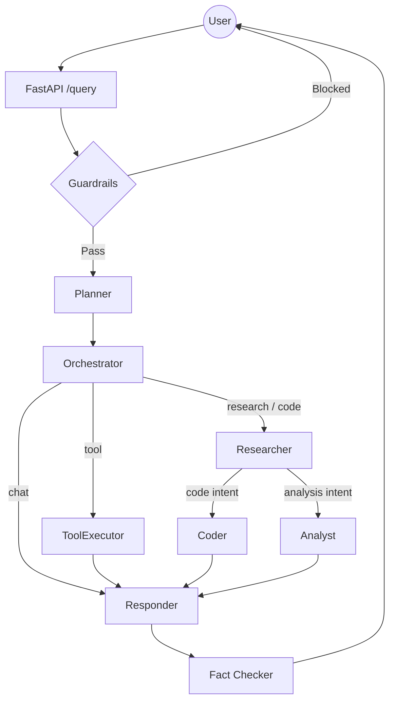

# Vantage RAG

Kartik's agentic RAG chatbot — a production-grade agentic RAG system built with **LangGraph**, a **Portkey LLM Gateway** (with Groq fallback), **Chroma** vector search, **Jina AI** embedding/reranking (with local fallbacks), and a **bounded guardrails gate** (deterministic rules + a single-call classifier). It answers questions from an indexed documentation corpus via a planner → orchestrator → sub-agent pipeline with a fact-checking pass.

## Key Features

- **Agentic Flow**: LangGraph state machine — planner classifies intent, orchestrator routes to researcher/analyst/coder sub-agents, responder synthesizes, fact_checker verifies grounding before returning.
- **Guardrails**: Bounded gate runs before the graph — a **zero-LLM rule layer** (prompt-injection phrase patterns, small-talk fast path, and an embedding **scope check** that declines far off-topic queries) plus **one time-boxed classifier call** per message. Every response reports an explicit `gate` state (`blocked | safe | skipped-not-ready | skipped-disabled | fail-open-error`), so a skipped/unconfigured gate is never mistaken for a safe one; readiness is surfaced in `/health`. `GUARDRAILS_FAIL_OPEN` configurable.
- **LLM Gateway**: All LLM calls route through Portkey (`@<slug>/<model>`, default `openai/gpt-oss-20b` under the `policy` slug) with an automatic Groq fallback when Portkey is unreachable.
- **Hybrid Retrieval**: Chroma Cloud vector search fused with in-memory BM25 via RRF, then re-ranked with the **Jina Reranker v3** API.
- **Embeddings**: `jina-embeddings-v3` (1024-dim) via Jina API, with local `mixedbread-ai/mxbai-embed-large-v1` fallback.
- **Local Parsing**: PDF, HTML, TXT, DOCX, PPTX parsed on-device — no external OCR service.
- **Observability**: Trace nesting with **Pydantic Logfire** across every node.
- **State**: Durable Postgres checkpointer (LangGraph `PostgresSaver`) with in-memory `MemorySaver` fallback.
- **API**: Sync `/query` and Server-Sent-Events `/query/stream`, optional bearer-token auth, Redis-backed (or in-memory) rate limiting.
- **Evaluation**: RAGAS-powered suite (6 metrics) with a Streamlit demo app and a headless `evals/run_evals.py --metrics` script.

---

## Agent Flow



Nodes in `app/agents/graph.py`: `planner` → `orchestrator` → sub-agents (`researcher`, `analyst`, `coder`, `tool_executor`) → `responder` → `fact_checker` → end.

---

## Providers

| Layer | Primary | Fallback |
|---|---|---|
| LLM | Portkey gateway (`@policy/openai/gpt-oss-20b`) | Groq direct (`openai/gpt-oss-20b`) |
| Embeddings | Jina API `jina-embeddings-v3` | local `mxbai-embed-large-v1` |
| Reranker | Jina API `jina-reranker-v3` | local cross-encoder `cross-encoder/ms-marco-MiniLM-L-6-v2` |
| Vector store | Chroma Cloud (`enterprise_rag`, cosine) | — |

Model/routing settings live in `app/config.py` and `app/gateway/client.py`.

## Repo Layout

```
app/
  main.py                 FastAPI app: /query, /query/stream, /graph
  agents/graph.py         LangGraph agent pipeline + checkpointer
  gateway/                Portkey client + Groq fallback
  guardrails/             bounded guardrails gate (rules + single-call classifier)
  services/retrieval/     Chroma, hybrid (BM25+vector), ranking, embedding
data/data/                Indexed corpus (PDF/DOCX/HTML/TXT/PPTX)
evals/
  pipeline.py             Eval pipeline wrapper around /query
  metrics.py              RAGAS 6-metric scoring (gateway judge)
  build_golden.py         Golden dataset generator (LLM-drafted + reviewed)
  run_evals.py            Headless runner (--metrics) → report.json
  app.py                  Streamlit eval dashboard
ui/st_cloud_ui.py         Main chat UI
```

## Evaluation

```bash
# 1. (One-time) draft + review the golden dataset
uv run python -m evals.build_golden --per-source 6     # writes evals/golden_dataset.json
#    review `reference` vs `relevant_contexts`, then set "_draft": false

# 2. With the backend running (uvicorn on :8000):
uv run python -m evals.run_evals                # guardrails pass-rate report
uv run python -m evals.run_evals --metrics      # full RAGAS run (slow, serialized)
uv run streamlit run evals/app.py               # interactive eval dashboard
```

Metrics (`evals/metrics.py`): Faithfulness, Answer Relevancy, Context Precision, Context Recall, Answer Correctness, Tool Correctness — scored with a Portkey gateway judge and Jina embeddings (`jina-embeddings-v3`; `EVAL_EMBEDDINGS=hf` falls back to `sentence-transformers/all-MiniLM-L6-v2`). Output: `evals/report.json`.

**Guardrails eval semantics** — each test case is classified `blocked` / `safe` / `INVALID` via the `gate` field the API now returns. Skipped gates (`skipped-not-ready`, `skipped-disabled`, `fail-open-error`) are marked **INVALID and excluded** from precision/recall — a gate that did not run is never counted as a miss. The report records `valid`/`invalid` counts alongside TP/TN/FP/FN.

Measured results (n=15 RAG samples, n=20 guardrail cases — committed in `evals/report.json`):

| RAGAS metric | score |
|---|---|
| Faithfulness | 0.038 |
| Answer Relevancy | 0.52 |
| Context Precision | 0.233 |
| Context Recall | 0.167 |
| Answer Correctness | 0.689 |
| Tool Correctness | 1.0 |

Guardrail gate tests: **n=20 → precision 1.0, recall 0.8, accuracy 0.9** (8 TP, 10 TN, 2 FN, 0 FP). The two misses: an Instagram-scraper request and an "ignore all rules" injection — both slipped past the single-call classifier without reaching the injection/roleplay rules.

## API

- `POST /query` — `{question, thread_id}` → sync JSON answer with `plan`, `paths`, `tools`, `fact_check`, `gate` (guardrails outcome state).
- `POST /query/stream` — same input, Server-Sent-Events of node-by-node progress; the `done` event carries `gate` too.
- `GET /graph` — graph visualization (auth-gated when `API_KEY` is set).

## Quick Start

```bash
uv sync                      # Windows-managed venv (WSL: use .venv/Scripts/python.exe)
cp .env.example .env         # fill in the keys below
uv run uvicorn app.main:app --reload --port 8000
uv run streamlit run ui/st_cloud_ui.py
```

Required env: `PORTKEY_API_KEY`, `PORTKEY_GATEWAY_URL`, `PORTKEY_PRIMARY_MODEL`, `GROQ_API_KEY` (fallback), `JINA_API_KEY` (embeddings/reranker). Optional: `POSTGRES_URI` (durable state), `API_KEY` (bearer auth), `REDIS_URL` (distributed rate limits).